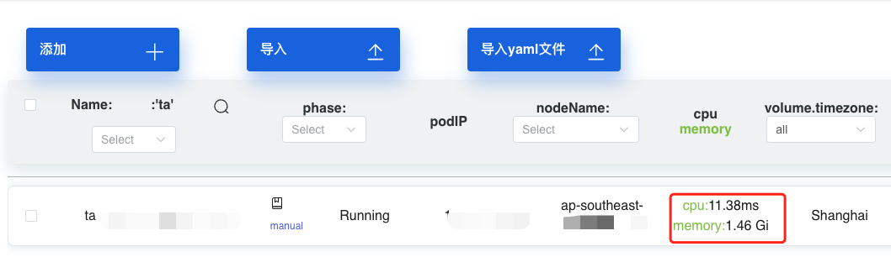
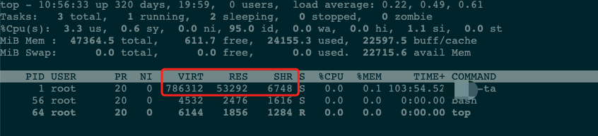
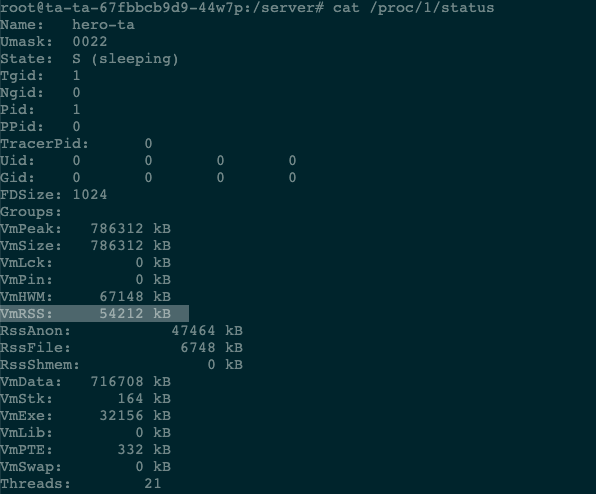

# Pod wss rss

问题的起因是，我看到 K8S 平台上的一个应用的内存占用很高，想着让研发看看 Pod 内存使用是不是有问题，是不是代码 Bug 导致的

研发同事进入到 Pod 中使用 top 命令，查看了内存占用(不高)，看到的结果和 K8S 平台上的内存占用出入很大，来挑战我说你这个平台统计的不准

首先进入容器之后执行的 top 命令看到的内存实际上并不是这个 Pod 中进程占用的内存，top 看到实际上的宿主机的，所以这个其实是不准的







那么问题来了， K8S 统计的内存占用应该看什么指标

kubectl top pod

top 命令得到的结果，指标是 container_memory_working_set_bytes 的内存使用量，并不是容器中的 container_memory_usage_bytes 指标的内存使用量

container_memory_usage_bytes = container_memory_rss + container_memory_cache + kernel memory

container_memory_working_set_bytes = container_memory_usage_bytes - total_inactive_file（未激活的匿名缓存页）

container_memory_working_set_bytes是容器真实使用的内存量，也是资源限制limit时的重启判断依据

由此可见， k8s 注重 container_memory_working_set_bytes(wss) ，我们的（参考网上）告警规则也是使用这个指标，那到底是应该选择 rss 还是 wss 作为告警指标呐

关于 active_file 和 inactive_file

Linux 系统会把进程占用后多余的内存用作 page cache，当访问文件后就加载到内存中，加速后面再次访问文件的速度

当系统需要更多常驻内存的时候，又会从 page cache 腾出空间，这种用途的内存叫做 file-backed memory（相对应与文件无关的叫anonymous memory）

page cache 分为 inactive_file 和 active_file ，第一次读写文件后的 cache ，属于 inactive_file ，多次访问这个文件之后，属于 active_file

inactive_file的cache是会可以被操作系统直接回收使用的，active_file不会直接回收，而是先变成inactive_file

本地验证

- 安装 metrics-server

```sh
# top 发现没有安装 metrics-server 服务
➜  ~ kubectl top pod ta-ta-7b6f5d56fb-94svm
error: Metrics API not available

# 安装 metrics-server
➜  ~ kubectl apply -f https://github.com/kubernetes-sigs/metrics-server/releases/latest/download/components.yaml
serviceaccount/metrics-server created
clusterrole.rbac.authorization.k8s.io/system:aggregated-metrics-reader created
clusterrole.rbac.authorization.k8s.io/system:metrics-server created
rolebinding.rbac.authorization.k8s.io/metrics-server-auth-reader created
clusterrolebinding.rbac.authorization.k8s.io/metrics-server:system:auth-delegator created
clusterrolebinding.rbac.authorization.k8s.io/system:metrics-server created
service/metrics-server created
deployment.apps/metrics-server created
apiservice.apiregistration.k8s.io/v1beta1.metrics.k8s.io created

# 再次 top 发现 metrics-server 服务不可用
➜  ~ kubectl top pod ta-ta-7b6f5d56fb-94svm
Error from server (ServiceUnavailable): the server is currently unable to handle the request (get pods.metrics.k8s.io ta-ta-7b6f5d56fb-94svm)

# describe 看下是什么问题
➜  ~ kubectl -n kube-system describe pod metrics-server-5b4fc487-qz6zk
Events:
  Type     Reason     Age                  From               Message
  ----     ------     ----                 ----               -------
  Normal   Scheduled  3m29s                default-scheduler  Successfully assigned kube-system/metrics-server-5b4fc487-qz6zk to kind-worker2
  Normal   Pulling    3m29s                kubelet            Pulling image "registry.k8s.io/metrics-server/metrics-server:v0.6.4"
  Normal   Pulled     3m20s                kubelet            Successfully pulled image "registry.k8s.io/metrics-server/metrics-server:v0.6.4" in 8.206459337s
  Normal   Created    3m20s                kubelet            Created container metrics-server
  Normal   Started    3m20s                kubelet            Started container metrics-server
  Warning  Unhealthy  9s (x20 over 2m59s)  kubelet            Readiness probe failed: HTTP probe failed with statuscode: 500

# log 再看下具体的问题
➜  ~ kubectl -n kube-system logs metrics-server-5b4fc487-cthhw
I1114 09:05:09.191872       1 serving.go:342] Generated self-signed cert (/tmp/apiserver.crt, /tmp/apiserver.key)
E1114 09:05:09.623326       1 scraper.go:140] "Failed to scrape node" err="Get \"https://172.18.0.2:10250/metrics/resource\": x509: cannot validate certificate for 172.18.0.2 because it doesn't contain any IP SANs" node="kind-control-plane"
...
E1114 09:05:09.632850       1 scraper.go:140] "Failed to scrape node" err="Get \"https://172.18.0.4:10250/metrics/resource\": x509: cannot validate certificate for 172.18.0.4 because it doesn't contain any IP SANs" node="kind-worker2"
E1114 09:05:09.644253       1 scraper.go:140] "Failed to scrape node" err="Get \"https://172.18.0.3:10250/metrics/resource\": x509: cannot validate certificate for 172.18.0.3 because it doesn't contain any IP SANs" node="kind-worker"

# 修改下启动参数 参考 https://github.com/kubernetes-sigs/metrics-server/issues/917
➜  ~ kubectl -n kube-system edit deploy metrics-server
spec:
      containers:
      - args:
        - --cert-dir=/tmp
        - --secure-port=4443
        - --kubelet-preferred-address-types=InternalIP,ExternalIP,Hostname
        - --kubelet-use-node-status-port
        - --metric-resolution=15s
        - --kubelet-insecure-tls

# 再次 top
➜  ~ kubectl top pod ta-ta-7b6f5d56fb-94svm
NAME                     CPU(cores)   MEMORY(bytes)
ta-ta-7b6f5d56fb-94svm   1m           27Mi
```

1. limit 是 256MiB

```sh
# 查看 /sys/fs/cgroup/memory/memory.stat文件
root@ta-ta-7b6f5d56fb-94svm:/server# cat /sys/fs/cgroup/memory/memory.stat

# 关注一下几个指标
total_cache 1294336
total_rss 26894336
total_inactive_file 1073152
total_active_file 221184

# 写入一个 100MB 的文件
root@ta-ta-7b6f5d56fb-94svm:/server# dd if=/dev/zero of=testfile_100m bs=1M count=100
100+0 records in
100+0 records out
104857600 bytes (105 MB, 100 MiB) copied, 0.438397 s, 239 MB/s

# 再次查看 /sys/fs/cgroup/memory/memory.stat文件
root@ta-ta-7b6f5d56fb-94svm:/server# cat /sys/fs/cgroup/memory/memory.stat

total_cache 106242048
total_rss 26947584
total_inactive_file 105963520
total_active_file 278528

# cache 和 inactive_file 增加了  100MB 而 rss 和 active_file 基本没变化

# 重复读取这个文件两次
root@ta-ta-7b6f5d56fb-94z svm:/server# cat testfile_100m > /dev/null

# 再次查看 /sys/fs/cgroup/memory/memory.stat文件
root@ta-ta-7b6f5d56fb-94svm:/server# cat /sys/fs/cgroup/memory/memory.stat

total_cache 106246144
total_rss 29638656
total_inactive_file 1105920
total_active_file 105140224

# cache 和 rss 基本没变化 active_file 则增加了 100MB

# 从指标上看 container_memory_working_set_bytes 是 129MB 
# 基本上是 usage - total_inactive_file 
# 也基本上是 rss + total_active_file
```

如此看来，使用 wss 作为告警指标并没有比 rss 更有优势

wss 指标的值更高可能因为 active_file 内存占用更多，所以会出现 wss 告警而用户并不需要处理，而且还难以跟业务方解释

而 rss 的指标则更符合大家原本使用 ECS 时代的习惯

可是普遍上我们监控容器内存的使用率还是用 wss/limit 来做
