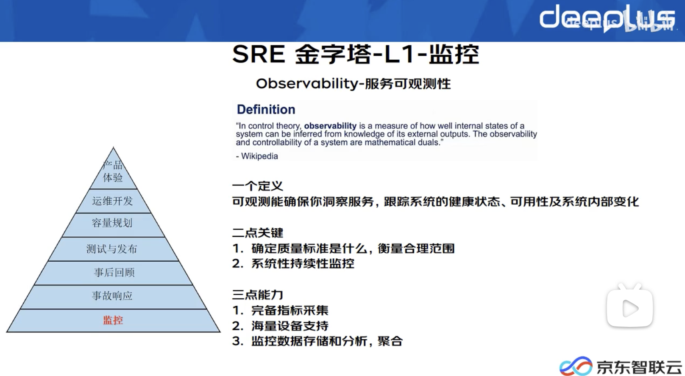

# Pod wss rss

问题的起因是，我看到 K8S 平台上的一个应用的内存占用很高，想着让研发看看 Pod 内存使用是不是有问题，是不是代码 Bug 导致的

研发同事进入到 Pod 中使用 top 命令，查看了内存占用(不高)，看到的结果和 K8S 平台上的内存占用出入很大，来挑战我说你这个平台统计的不准

首先进入容器之后执行的 top 命令看到的内存实际上并不是这个 Pod 中进程占用的内存，top 看到实际上的宿主机的，所以这个其实是不准的

那么问题来了， K8S 统计的内存占用应该看什么指标



先在本地验证

```sh
➜  ~ kubectl  top pod nginx-cd55c47f5-6mk9n
error: Metrics API not available


➜  ~ kubectl apply -f https://github.com/kubernetes-sigs/metrics-server/releases/latest/download/components.yaml
serviceaccount/metrics-server created
clusterrole.rbac.authorization.k8s.io/system:aggregated-metrics-reader created
clusterrole.rbac.authorization.k8s.io/system:metrics-server created
rolebinding.rbac.authorization.k8s.io/metrics-server-auth-reader created
clusterrolebinding.rbac.authorization.k8s.io/metrics-server:system:auth-delegator created
clusterrolebinding.rbac.authorization.k8s.io/system:metrics-server created
service/metrics-server created
deployment.apps/metrics-server created
apiservice.apiregistration.k8s.io/v1beta1.metrics.k8s.io created

➜  ~ kubectl get pod
NAME                    READY   STATUS    RESTARTS      AGE
nginx-cd55c47f5-6mk9n   1/1     Running   1 (11d ago)   63d
nginx-cd55c47f5-6np6v   1/1     Running   1 (11d ago)   63d
➜  ~ kubectl top pod nginx-cd55c47f5-6mk9n
Error from server (ServiceUnavailable): the server is currently unable to handle the request (get pods.metrics.k8s.io nginx-cd55c47f5-6mk9n)


➜  ~ kubectl -n kube-system describe pod metrics-server-5b4fc487-qz6zk
Events:
  Type     Reason     Age                  From               Message
  ----     ------     ----                 ----               -------
  Normal   Scheduled  3m29s                default-scheduler  Successfully assigned kube-system/metrics-server-5b4fc487-qz6zk to kind-worker2
  Normal   Pulling    3m29s                kubelet            Pulling image "registry.k8s.io/metrics-server/metrics-server:v0.6.4"
  Normal   Pulled     3m20s                kubelet            Successfully pulled image "registry.k8s.io/metrics-server/metrics-server:v0.6.4" in 8.206459337s
  Normal   Created    3m20s                kubelet            Created container metrics-server
  Normal   Started    3m20s                kubelet            Started container metrics-server
  Warning  Unhealthy  9s (x20 over 2m59s)  kubelet            Readiness probe failed: HTTP probe failed with statuscode: 500

➜  ~ kubectl -n kube-system edit deploy metrics-server
spec:
      containers:
      - args:
        - --cert-dir=/tmp
        - --secure-port=4443
        - --kubelet-preferred-address-types=InternalIP,ExternalIP,Hostname
        - --kubelet-use-node-status-port
        - --metric-resolution=15s
        - --kubelet-insecure-tls
```
